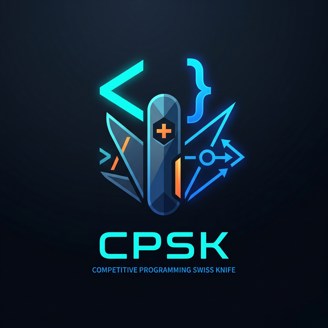
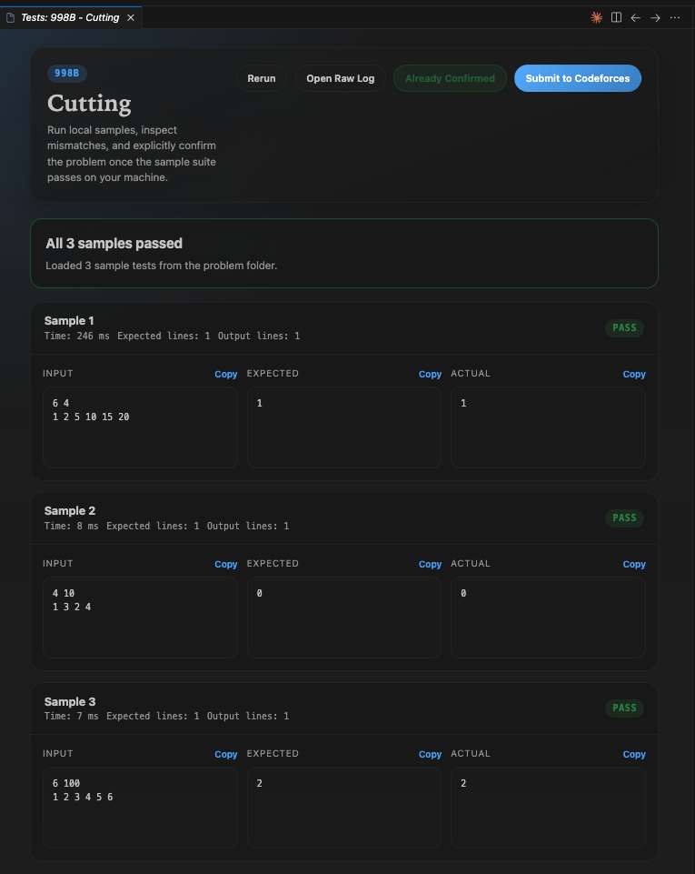
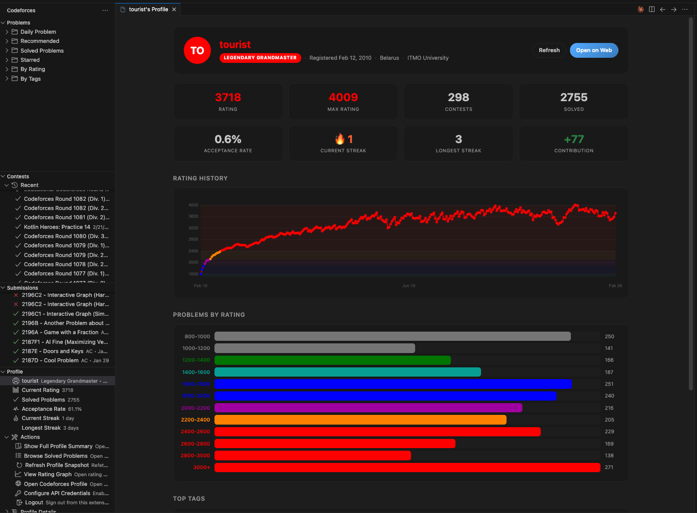
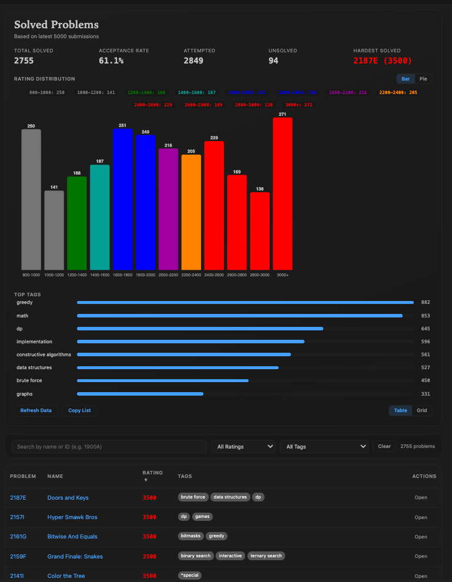

<div align="center">
  
  <h1>Competitive Programming Swiss Knife</h1>
  <p><b>The ultimate unified toolkit for competitive programmers in VS Code.</b></p>
  <p>
    <a href="https://marketplace.visualstudio.com/items?itemName=albarham.cp-swiss-knife&ssr=false#overview"><strong>VS Code Marketplace</strong></a> •
    <a href="https://open-vsx.org/extension/albarham/cp-swiss-knife"><strong>Open VSX Registry</strong></a>
  </p>
  <p>
    
    
  </p>
</div>

> 🚀 **Roadmap Note:** This project is designed to be the definitive "Swiss Army Knife" for competitive programming. **Currently, it features full Codeforces integration.** In future updates, we will be rolling out support for other online judges (such as AtCoder, LeetCode, CodeChef) along with additional tools to streamline your competitive programming workflow!

Solve Codeforces problems directly in VS Code — browse problems, join contests, run local tests, and track your progress without ever leaving the editor.

## Features

### Problem Explorer
- **Browse** all problems organized by **Rating** (12 ranges), **Tags** (top 30), **Solved**, and **Starred**
- **Daily Problem** — a fresh rating-appropriate challenge seeded daily
- **Smart Recommendations** — top 20 personalized suggestions based on your current rating
- Color-coded difficulty dots and green solved checkmarks
- Full-text search by problem name or ID
- Right-click context menu: Preview, Open on Codeforces, View Submissions, Mark/Unmark Solved, Star/Unstar

### Problem Preview
- Rich in-extension problem statement with time/memory limits, sample cases, tags, and rating
- **Open in Editor** — generates a ready-to-test solution file from your language template
- **Run Local Tests** button directly in the preview toolbar
- **Import Samples from Clipboard** — paste the Examples section from any Codeforces problem page

### Local Testing



- Dedicated **Test Results panel** with per-case pass/fail, diff view, input/output inspection, and rerun
- **Custom Test** — run against any input you type
- Supports C++, Python, Java, Kotlin, Rust, Go, C#, JavaScript


### Contest Explorer
- Upcoming, running, and recent contests with live countdowns in the sidebar and status bar
- **Contest Detail Panel** — opens inside VS Code showing your rank, rating change, hacks, and per-problem status
- **Standings Panel** — paginated standings with friends filter, opens from Contest Detail Panel
- `autoOpenContestProblems` setting: automatically opens all problem files when viewing a live contest
- Contest reminders before start (configurable lead time)
- One-click contest registration

### User Profile Dashboard



- Current rating, max rating, rank, contribution, and registration date
- **Current Streak** and **Longest Streak** — consecutive daily solve streaks
- Interactive **Rating Graph** with full contest history table
- Problems solved by rating bucket and top solved tags
- **Browse Solved Problems** — searchable, filterable panel with bar/pie rating chart, tag filter, sort, and export

  

- **Submissions History** view with verdict filtering (AC, WA, TLE, MLE, RTE, CE)

### Template Management
- Built-in paste-ready starters for all 8 supported languages
- **Edit Language Template** (`Codeforces: Edit Language Template`) — opens your template in VS Code; changes apply to all new solution files for that language
- **Reset Language Template to Default** — restores the built-in starter at any time
- Supports `{problemName}`, `{contestId}`, `{index}`, `{timeLimit}`, `{memoryLimit}` placeholders

---

## Getting Started

1. **Install** the extension from the VS Code Marketplace.
2. Open the **Codeforces** icon in the Activity Bar (left sidebar).
3. Click **Login** and enter your Codeforces handle.
4. *(Optional)* Click **Configure API Credentials** to enable authenticated API features.
5. Browse problems → click one to preview → click **Open in Editor** to start coding.
6. Press `Cmd/Ctrl+Alt+T` to run local sample tests.


---
## API Authentication

For authenticated API features (e.g., richer profile analytics, viewing hacks during contests) you can optionally add your Codeforces API credentials:

1. Visit the [Codeforces API settings page](https://codeforces.com/settings/api).
2. Click **Add API key**.
3. You will be given a **Key** and a **Secret**.
4. Run `Codeforces: Configure API Credentials` in VS Code (or click the key icon in the Profile view toolbar).
5. Enter the **Key** when prompted, followed by the **Secret**.

> Credentials are stored securely in VS Code's **SecretStorage** — never in plain text.

---
## Commands

| Command | Shortcut | Description |
|---------|----------|-------------|
| `Codeforces: Login` | — | Authenticate with your handle |
| `Codeforces: Logout` | — | Sign out |
| `Codeforces: Run Sample Tests` | `Cmd+Alt+T` | Run local sample tests |
| `Codeforces: Preview Problem` | `Cmd+Alt+P` | Preview problem in a webview |
| `Codeforces: Daily Problem` | — | Open today's recommended problem |
| `Codeforces: Edit Language Template` | — | Open your code template for editing |
| `Codeforces: Reset Language Template to Default` | — | Restore built-in template |
| `Codeforces: Show Solved Problems` | — | Open the interactive solved problems browser |
| `Codeforces: Show Rating Graph` | — | View your rating history chart |
| `Codeforces: Refresh Profile Snapshot` | — | Re-fetch submission analytics |
| `Codeforces: Search Problems` | — | Search by name or ID |
| `Codeforces: Set Default Language` | — | Change default language for new files |
| `Codeforces: Filter by Tag` | — | Filter problems explorer by tag |
| `Codeforces: Filter by Rating` | — | Filter problems explorer by rating range |
| `Codeforces: Import Samples From Clipboard` | — | Import test cases from clipboard |

---

## Settings

| Setting | Default | Description |
|---------|---------|-------------|
| `codeforces.handle` | `""` | Your Codeforces handle |
| `codeforces.workspaceFolder` | `~/.codeforces` | Root folder for solution files |
| `codeforces.defaultLanguage` | `cpp` | Language for new solution files |
| `codeforces.cppCompiler` | `g++` | C++ compiler command |
| `codeforces.cppFlags` | `-std=c++17 -O2 -Wall -Wextra` | C++ compiler flags |
| `codeforces.pythonCommand` | `python3` | Python interpreter |
| `codeforces.javaCommand` | `java` | Java command |
| `codeforces.enableBrowserExtraction` | `true` | Browser-assisted problem import on 403 |
| `codeforces.autoOpenContestProblems` | `false` | Auto-open all problems when viewing a live contest |
| `codeforces.contestReminders` | `true` | Show notification before contests start |
| `codeforces.reminderMinutesBefore` | `15` | Lead time for contest reminders (minutes) |
| `codeforces.showStatusBar` | `true` | Show contest countdown in status bar |
| `codeforces.includeGym` | `false` | Include Gym contests in contest list |
| `codeforces.friendHandles` | `[]` | Friend handles to highlight in standings |
| `codeforces.template.cpp` | `""` | Path to custom C++ template (set via Edit Template command) |
| `codeforces.template.python` | `""` | Path to custom Python template |
| `codeforces.template.java` | `""` | Path to custom Java template |

---

## Supported Languages

| Language | Compiler/Runtime |
|----------|-----------------|
| C++ | g++ (GNU G++17 / G++20) |
| Python | python3 |
| Java | javac + java |
| Kotlin | kotlinc |
| Rust | rustc |
| Go | go |
| C# | dotnet / mono |
| JavaScript | node |

---

## Solution File Layout

```
~/.codeforces/
├── problemset/
│   ├── 1A-Theatre_Square/
│   │   ├── cf_1A.cpp          ← your solution
│   │   ├── .problem.json      ← metadata (used by test runner)
│   │   ├── input1.txt
│   │   └── output1.txt
│   └── 1900A-Tricky_Template/
│       └── cf_1900A.cpp
└── templates/
    ├── template.cpp            ← your custom C++ template
    └── template.py
```

---


## CodeLens Actions

When editing a solution file (`cf_*.cpp`, `cf_*.py`, etc.), action buttons appear at the top:

- **Run Tests** — run all sample test cases
- **Import Samples** — import from clipboard

---

## Troubleshooting

**Problem statement shows a fallback page (403)?**
Enable `codeforces.enableBrowserExtraction` and configure `codeforces.chromeExecutablePath`. The extension will open Chrome, let you complete any verification, then extract the statement automatically.


**Tests not running?**
Ensure the required compiler/interpreter is on your PATH. Check `codeforces.cppCompiler` and `codeforces.pythonCommand`.

**Profile stats not loading?**
Run `Codeforces: Refresh Profile Snapshot`. Stats require a successful API fetch of your recent submissions.

---

## Contributing

Issues and pull requests welcome on [GitHub](https://github.com/mohammad-albarham/cp-swiss-knife).

---

## License

MIT — see [LICENSE](LICENSE) for details.

---

**Happy Coding!** 🚀
